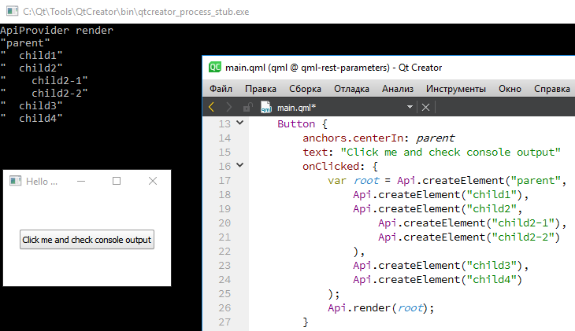

# QML Singleton C++ provider slot  that takes variable number of arguments

### Question:

As everyone knows, in JavaScript all functions can take any number of arguments. In Qt you can make QObject, whose methods accessible from QML, having marked it by Q_INVOKABLE. For example:

```
class myObj: public QObject
{
    Q_OBJECT

//...

public slots:
    Q_INVOKABLE QJSValue myFunction(QJSValue value);

//...

};
```

And then you can call it from JS:

```
(function(){
    //like this:
    var result = myObj.myFunction("test");
    //but also like this:
    var result2 = myObj.myFunction(1,2,3,4,5); //,6,7,8, ..., 9998, 9999
})();
```

So, how to handle variable number of parameters on C++ side? On JS side we have "arguments" object. Is there any analog for Q_INVOKABLE methods?

### Answer:

It's looks like this is impossible for every QObject, but you can wrap your singleton C++ backend SLOT with custom JS script, which will join together multiple arguments to single array. This can be done through the [qmlRegisterSingletonType](https://doc.qt.io/qt-5/qqmlengine.html#qmlRegisterSingletonType) method callback, which provides access to the QJSEngine instance.

```
QJSValue ApiProvider::initSingletonType(QQmlEngine *qmlEngine, QJSEngine *jsEngine) {
    qDebug() << "ApiProvider initSingletonType";
    Q_UNUSED(qmlEngine);
    QJSValue instance=jsEngine->newQObject(new ApiProvider(jsEngine));
    QJSValue restProvider=jsEngine->evaluate(
        "(function (instance) {" \
        "   instance.createElement=function(type,...child){" \
        "       return instance.createElementInternal(type,child);" \
        "   }; " \
        "   return instance;" \
        "})"
    );
    if (restProvider.isError()) {
        qCritical() << restProvider.toString();
        return QJSValue();
    } else {
        QJSValue result=restProvider.call({instance});
        if (result.isError()) {
            qCritical() << result.toString();
            return QJSValue();
        } else {
            return instance;
        }
    }
}

...


qmlRegisterSingletonType(
    "com.tripolskypetr.quitejs",
    1, 0,
    "Api",
    ApiProvider::initSingletonType
);

```

This application implements a conditional jsx factory, where each element can have an arbitrary number of descendants in rest parameters

